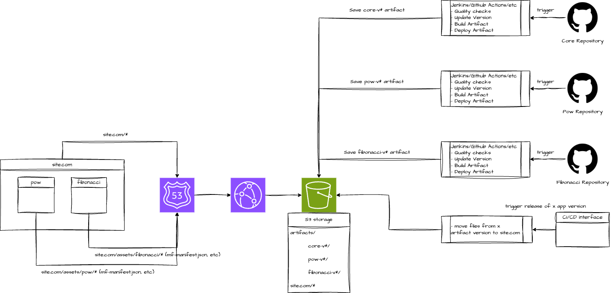

# Capstone Project

The project provides example how to implement microfrontend architecture using module federation plugin with vite.

## Structure

The example has 2 remote projects (fibonacci and pow) and 1 host project (core). Core project maintenances the template of an application and imports remote projects to use them as separate pages. Host projects expose index component for importing.

## Installation & Run

1. Run core project
   1. Go to core dir
   2. Run `yarn install`
   3. Run `DEV_HOST=127.0.0.1 DEV_PORT=3000 yarn start`
1. Run core fibonacci
   1. Go to fibonacci dir
   2. Run `yarn install`
   3. Run `DEV_HOST=127.0.0.1 DEV_PORT=3001 yarn start`
1. Run core pow
   1. Go to pow dir
   2. Run `yarn install`
   3. Run `DEV_HOST=127.0.0.1 DEV_PORT=3002 yarn start`
1. Open `localhost:3000` in browser

## CI/CD example

A storage (e.g Amazon S3) keeps different versions of applications in `artifacts` directory. For example:
+ `artifacts/core-v1` - 1st version of main template
+ `artifacts/pow-v2` - 2nd version of pow module
+ `artifacts/fibonacci-v1` - 2nd version of fibonacci module

Artifacts can be created during CI/CD process, for example after merge to master, or manually from a certain branch using an automation service (e.g Jenkins). 

Running version of an application is stored in `site.com` directory. For example:
+ `site.com/`
  + `assets/` - stores modules
    + `pow/` - running verions of pow module
      + `mf-manifest.json` - map of components and related scripts
      + `static/` - built js chunks
      + ...
    + `fibonacci/` - running verions of fibonacci module
      + `mf-manifest.json` - map of components and related scripts
      + `static/` - built js chunks
      + ...
  + `index.html` - main template index file
  + `static/` - main template built js chunks
  + ...

An automation service can be used to update a running version, the service replaces current built files with files from artifcats directory. For example if it's needed to release 2nd version of pow module, the service will copy files from `artifacts/pow-v2` to `site.com/assets/pow` directory and remove prev content.

A router (e.g Amazon Router 53 + Amazon Cloudformation) is configured to provide static files from `site.com` directory.
