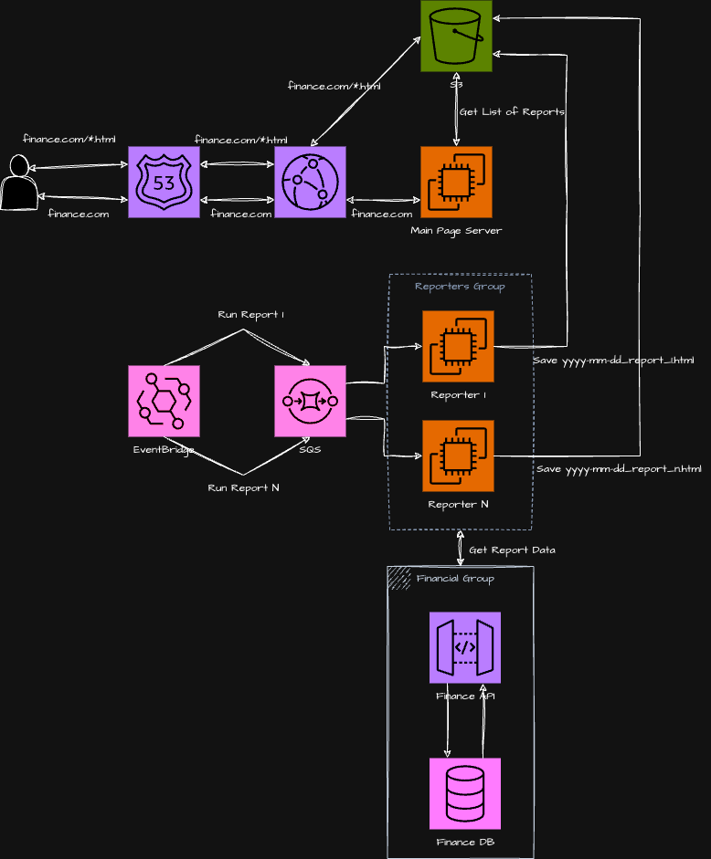

# Case 1. Information System

Let's assume a scenario when every day there can be a lot of different financial reports in html format, and each report has a lot of charts and non trivial design in general. In that case different teams can be involved in the report development.

Let's assume that each report generation may take up to 1 hour.

## Option 1. Full SSR

### High Overview

Implement the task using full server side rendering approach. The server (let it be NodeJS which runs in AWS ECS/EC2) maintenances the template which dynamically includes links to generated reports from a storage (let it be AWS S3). A scheduler (let it be AWS EventBridge) schedules a task in a queue (let it be AWS SQS) to generate the report. The service (let it be NodeJS which runs in AWS ECS/EC2) which is responsible for the report generation listens the queue and saves the report in the storage. The service can communicate with Calculation API to get financial data.

Using cloud services (e.g AWS) it's possible to keep the whole infrastracture in configuration templates. And services provide native features to log queued tasks and to monitor if they failed.

To maintain source code of services (the server with root template and report generators) Github can be used. To deploy the code on cloud Github Action can be used.

If new types of report appear which should be developed by a new team it's needed to configure new Github Action for new project to deploy it on a cloud service. Also it's needed to configure the task scheduler to schedule new type of task which new service will handle.

### Pros

+ Good SEO optimized due to full static generation
+ Easy to maintain
  + configure generation time
  + monitor generation tasks process
  + add new complex reports

### Cons

+ If there can be common components among the main page and report pages it's needed to write separate npm package with common components
+ Redirection to reports will be with 'flickering'

## Option 2. SSR + SPA

// TODO: write me
