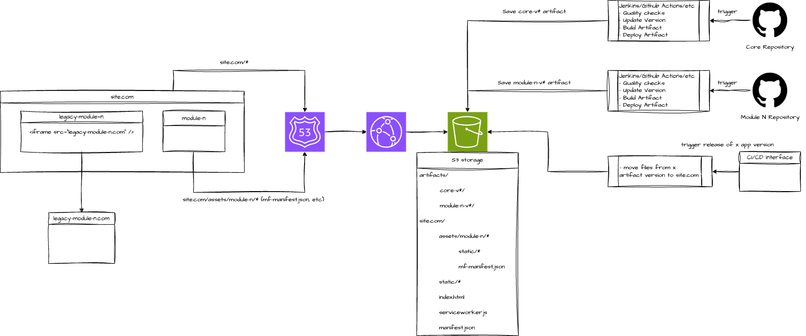

# Case 2. Financial Platform

Implement the web application which consits of loosely coupled modules and can be used on mobile devices as well. Modules should be developed and supported by different teams.

## Option 1. PWA + module federation

### High Overview

Implement a PWA with module federation plugin to import separate independed modules.

The application can be splitted on different independed modules which could be supported by different teams, for example:
+ core - main template of the applicaiton
+ module-n - independed module n of the app
+ legacy-module-n - legacy module n of the app

A storage (e.g Amazon S3) keeps artifacts of different versions of modules in `artifacts` directory. For example:
+ `artifacts/module-1-v1` - version 1 of module 1 
+ `artifacts/module-1-v1` - version 1 of module 1 
+ `artifacts/module-n-v2` - version 2 of module n
+ `artifacts/core-v1` - version 1 of main template
+ etc.

The storage keeps working version of the application in `site.com` directory. For example:
+ `site.com`
  + `assets`
    + `module-n` - module n files
      + `static/` - built js chunks
      + `mf-manifest.json` - map of components and related scripts
    + ...
  + `index.html` - index file of main template
  + `manifest.json` - configs for PWA
  + `serviceworker.js` - service worker of main template to improve user experience (e.g add caching and other common PWA features)

A router (e.g Amazon Route 53 + Cloudformation) is configured to use static files from `site.com` directory for `site.com` domain.

Separate teams are responsible for their own modules and can use different technologies. But in the end they must configure module federation plugin to expose public components/scripts of their modules, so they could be imported dynamically by the main template.

To build new artifact teams can use an automation service (e.g Jenkins) to save their static files in the storage in `artifacts` directory.

To release a certain version teams can use the automation service to move static files from `artifacts` to `site.com`. E.g to release 2nd verion of module n, they need to trigger the automation service to copy content from `artifacts/module-n-v2` to `site.com/assets/module-n`.

To support legacy modules of the application iframes can be used in the main template to show old sites in the same application.

If a new module should be integrated, a module team must communicate with core team to add import of new module in the main template. After that module team can deploy new changes independently.

### Pros

+ Seamless transition between different modules in the same application
+ Highly independent development of application modules
+ If one module fails all other should work (except when the core template throws an error)

### Cons

+ Bad CEO optimization, all content renders dynamically on client side
